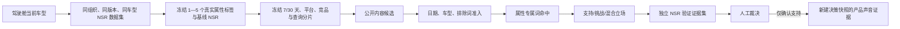

# MMN 时间窗采集与 NSR 公开讨论验证使用说明

版本：本地验收版 `beta-1.03-20260723-nsr-validation-1`
适用范围：国内版决策驾驶舱、社媒趋势中心、品牌传播穿透中心
当前状态：本地实现并隔离验收，尚未提交、推送或部署生产

## 1. 这项功能解决什么问题

本功能把“最多采几页”改成业务可理解的“最近 7 天 / 最近 30 天”，同时保留页数、候选数、请求数和成本上限作为安全边界。决策驾驶舱可读取当前选定车型的真实属性 NSR 标签，再用公开社媒讨论做独立验证。

它只回答：在指定日期、指定平台的公开讨论中，是否出现了与该车型及该属性直接相关的支持、挑战或混合证据。

它不做以下事情：

- 不重算、覆盖或修正原始 NSR；
- 不把传播声量解释成市场需求、购买意愿或销量因果；
- 不借用其他车型的 NSR 标签或证据；
- 不用泛化的“好用、难用、吐槽”等情绪词单独证明某个具体属性；
- 不把未经人工确认的机器归类直接写入后续决策。

## 2. 数据之间的线性关系



关键门槛是“车型命中”和“属性专属词命中”必须同时成立。情绪词只用于判断立场，不能决定属于哪个属性。

## 3. 在界面上怎么用

### 3.1 选择车型

1. 进入“决策驾驶舱”。
2. 从管理层车型选择器选择本次分析车型。
3. 打开页面下方的“完整驾驶舱决策报告”。
4. 找到“NSR 公开讨论验证”。

模块只读取当前车型的数据。快速切换车型时，旧请求即使晚返回也不会覆盖新车型。

### 3.2 选择验证标签

系统显示当前车型真实数据集中可用的属性标签、基线 NSR 和数据版本。一次至少选择 1 个、最多 5 个标签。

如果页面提示“当前车型没有可用属性 NSR”，说明源数据只含总 NSR 或缺少属性层，不会生成默认标签，也不会借用其他车型数据。

### 3.3 选择时间窗

- 最近 7 天：包含今天，共 7 个自然日；默认最多 3 页/查询、每平台最多 60 个候选、每标签每平台最多 20 条证据。
- 最近 30 天：包含今天，共 30 个自然日；默认最多 5 页/查询、每平台最多 100 个候选、每标签每平台最多 30 条证据。

日期按 Asia/Shanghai 自然日计算，起止日均包含。页数仍是保护上限，不是业务范围；只有发布时间落在冻结日期内的内容才可进入证据集。

### 3.4 预览计划

点击“预览采集计划”。确认以下内容：

- 车型是否正确；
- NSR 标签是否正确；
- 起止日期是否正确；
- 平台是否包含抖音、小红书和微博；
- 查询分片、最大请求数、候选上限是否可接受。

预览后若源 NSR 数据版本变化，启动会返回“数据版本已变化”，必须重新预览。客户端不能自行修改基线 NSR、标签或数据指纹。

### 3.5 启动与等待

点击“开始验证”。任务进入持久化队列，页面显示阶段与进度。刷新页面或重新进入车型后，会通过项目标识恢复最近任务，不需要重复发起。

同一冻结计划若已有运行中的任务，重复点击会返回同一任务；已采集的相同公开请求会走缓存，避免重复成本。

### 3.6 读取覆盖结果

每个平台分别显示：

- 访问页数；
- 原始候选数；
- 日期和规则过滤后的有效数；
- 最早、最晚有效发布时间；
- 停止原因。

常见停止原因：

- `source_exhausted`：数据源已无下一页；
- `candidate_limit`：达到候选安全上限；
- `partial_page_limit`：达到页数上限，可能仍有下一页；
- `platform_unavailable`：该平台本轮不可用，其他平台结果仍保留；
- `budget_limit`：请求或成本预算不足，需要人工调整；
- `cache_hit`：使用相同冻结请求的已有结果。

“三平台有内容”不等于“标签有证据”。只有同时命中车型和属性专属词的内容，才会进入该标签的证据明细。

### 3.7 查看证据与人工裁决

每个标签分别显示基线 NSR、证据数和支持/挑战/混合/中性数量。点击原文链接核对发布时间、车型、属性语义和上下文，再选择：

- 确认支持；
- 确认挑战；
- 混合；
- 证据不足。

裁决会持久化。只有“确认支持”会成为以后新建决策快照可读取的产品声音证据；其余裁决只留在验证记录中。已有历史快照不会被回填或覆盖。

## 4. 与社媒趋势中心、品牌传播穿透中心的关系

三处共用同一采集底座，但输出数据集彼此独立：

- 社媒趋势中心：变化信号、用户语言和竞品传播占位；
- 品牌传播穿透中心：品牌关联、来源角色、代表事件和竞品观察；
- NSR 公开讨论验证：同车型、同属性的证据与人工裁决。

它们可以引用同一条公开原文，但不能互相替代结论。品牌关联不等于市场渗透，社媒热度不等于成交，NSR 验证也不改写 NSR。

## 5. 管理员启用与本地运行

默认开关关闭。启用时至少配置：

```bash
MMN_SOCIAL_EVIDENCE_V2_ENABLED=true
MMN_SOCIAL_EVIDENCE_WORKER_MODE=thread
MMN_SOCIAL_EVIDENCE_DB=/absolute/path/social_evidence.sqlite
MMN_SOCIAL_EVIDENCE_RAW_DIR=/absolute/path/social_evidence_raw
```

正式部署建议使用独立 Worker，而不是 Web 进程线程；生产发布前必须单独确认外部数据服务密钥、组织日预算、持久卷、备份和回滚。用户界面不得显示供应商名称、密钥、原始错误或数据指纹。

主要接口：

- `GET /api/social-evidence/nsr-context?edition=china&model=车型`
- `POST /api/social-evidence/query-plans/preview`
- `POST /api/social-evidence/jobs`
- `GET /api/social-evidence/jobs/{jobId}`
- `GET /api/social-evidence/jobs/latest`
- `GET /api/social-evidence/marts/latest`
- `GET|POST /api/social-evidence/marts/{martId}/adjudications`

## 6. 异常处理

- 标签为空：检查该车型是否登记了属性 NSR；总 NSR 不能替代属性 NSR。
- 数据版本变化：重新进入当前车型并重新预览。
- 平台部分失败：查看平台覆盖，不要删除其他平台已验证结果；可使用原冻结计划重试。
- 证据很多但标签证据为零：候选可能只命中车型，没有命中属性专属词，这是正确的“证据不足”。
- 刷新后任务消失：检查项目标识、组织、版本和车型是否一致。
- 新决策快照没有联动结果：确认裁决为“确认支持”，并在裁决后新建快照；历史快照不会被修改。

## 7. 验收检查清单

- 7 天和 30 天日期均按上海自然日冻结，起止日包含；
- 抖音、小红书分别显示自己的覆盖和停止原因；
- 平台失败不抹掉其他平台；
- 同车型真实 NSR 标签可选，缺数车型明确阻断；
- 泛化情绪内容不会同时进入多个属性；
- 原始 NSR 在采集、裁决和新快照后保持不变；
- 刷新可恢复任务和裁决；
- 只有人工确认支持进入新决策证据；
- 桌面和 390px 移动端无横向溢出；
- 模块字体继承 MMN 主字体，只使用 400、500、600、700 四档字重。

## 8. 本次本地验收说明

本地隔离环境使用数据库副本和独立证据库，不触碰当前 8765 服务。7 天真实联合采集覆盖抖音、小红书、微博；修正泛化情绪归因后，相同候选被重新构建为“属性证据不足”，证明系统宁可不下结论，也不制造属性验证。生产是否具备实时数据、密钥和 Worker 条件，仍需发布工单单独验收。
